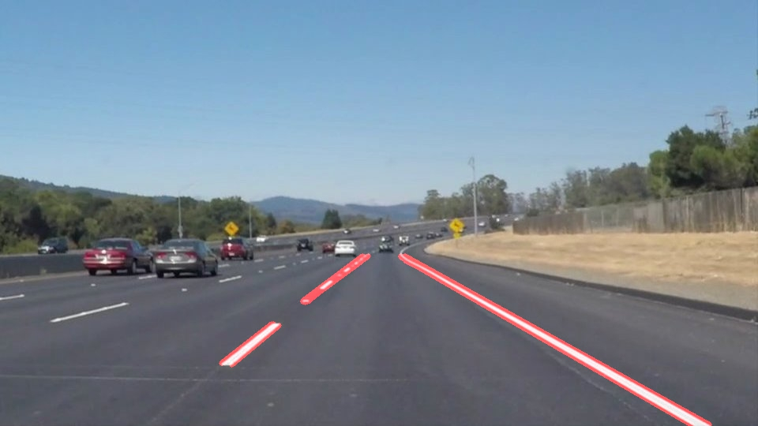
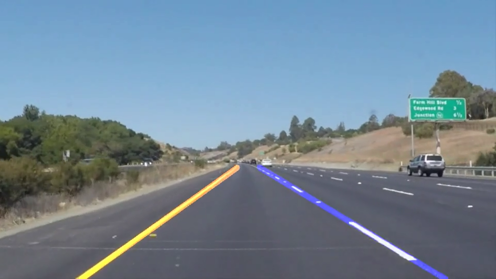
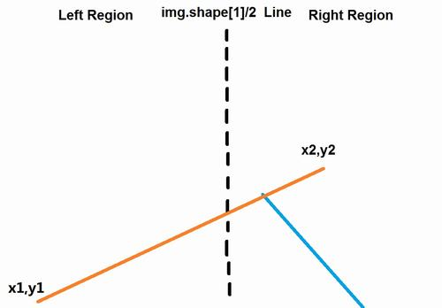
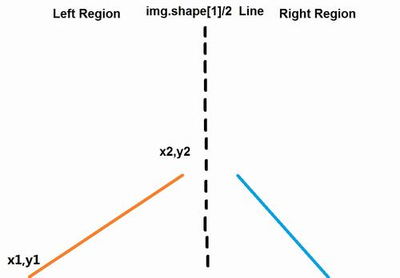
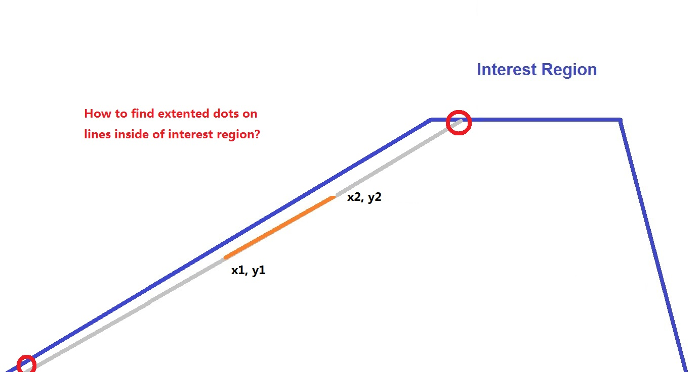
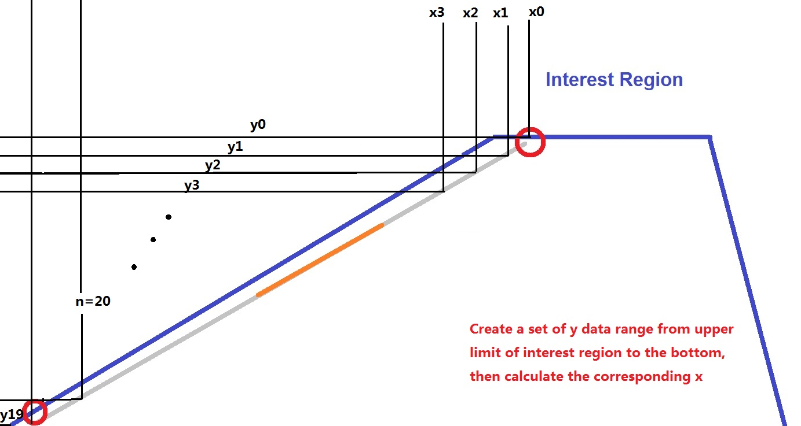
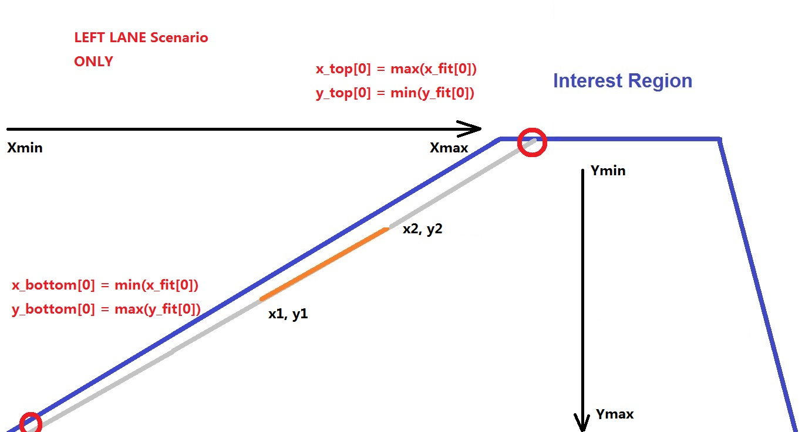
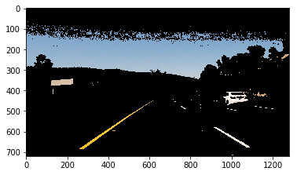

# **Finding Lane Lines on the Road** 

## Introduction
The project is aim to detect the road lane for the future usage of PID control in self-driving car.
Two types of code is implemented.
* **Basic lane detection**, computer vision process with greyscale image only shows edges of lanes.  
* **Higher level lane detection**, with **HSV color** and left/right **lane recognition**.
* **P1.ipynb** stores all code.

## Table of contents
1. Goals
2. Insight
3. Reflection
4. Conclusion
5. Reference


## Goals
* **Basic Lane Finding Pipeline** by combining the basic _Helper Function_, result shows in below:


<p style="text-align: center;">Raw red lines in the image.</p>

* First trial **video output**, turns static image into a series frames of movie.
* **draw_line** function improvement with fully extended lines and left/right lane is treated differently 


<p style="text-align: center;">Left lane exist in <font color="orange">orange</font> and right in <font color="blue">blue</font>.</p>

* In **Challenge** program, a `hsl` function is used to convert BGR image to HSL, we can use this to extract a colored object, in our case, the white and yellow lane color need to be extract. According to [OpenCV official document](https://docs.opencv.org/3.2.0/df/d9d/tutorial_py_colorspaces.html), _in HSV and HSL, it is more easier to represent a color than in BGR color-space._

## Insight
Since the technology used in the class, like **Canny Edge/Region of Interest/Hough Transform Line Detection**, is mainly taught by Udacity team and contribute by OpenCV, so I cannot declare most of those function is my original insight. The exclusive algorithm I made is:
* The goal to find out left and right lane encourage me to find out a `draw_lines_avg` function. Which include:
    * Detect the lane by slope of the line, also the exist region of point x1. see `line 101` in `In [14]`.
    * Filter out error-leads line objects by restrict the length into 50, see `line 109` and `line 111` in `In [14]`. Avoiding jitter in movie.
    * Use `stats.linregress` function in `scipy` library to calculate slope more fast and efficiency.  
    
    <p style="text-align: center;">Before Region Split, the point locate at left and right may leads to a massive slope-changed lane.</p>

    
    <p style="text-align: center;">After Region Split.</p>

    * Produce enough data set (like particles in [Particle Filter](https://en.wikipedia.org/wiki/Particle_filter)) under the linear regression line, helped to find out the extended dots inside the mask region.
    
    <p style="text-align: center;">Fast-find the dots on edge.</p>
    
    
    <p style="text-align: center;">Creating fitting data on line.</p>

    
    <p style="text-align: center;">Edge dots is the mixture of max or min of fitting data.</p>

* In the challenge program, `hsl` is used to filter out the white and yellow color for the purpose of better lane detection.


<p style="text-align: center;">Image shows cv2 detect the target color in HSL but not in greyscale.</p>

## Reflection

### Main pipeline

Please check `P1.ipynb` about sub-function for more, here only shows the main pipeline code as:
```
def process_image(frame):
  
    # Apply color selection
    hsl_image = hsl(frame)

    # Convert it into grayscale and display again
    gray = grayscale(hsl_image)

    # Define a kernel size and apply Gaussian smoothing
    kernel_size = 5
    blur_gray = gaussian_blur(gray, kernel_size)

    # Define our parameters for Canny and apply
    low_threshold = 100
    high_threshold = 200
    edges = canny(blur_gray, low_threshold, high_threshold)

    # This time we are defining a four sided polygon to mask
    im_x = frame.shape[1]
    im_y = frame.shape[0]
    x_margin_l = 9/20
    x_margin_r = 11/20
    y_margin = 0.6
    vertices = np.array([[(0,im_y),
                          (x_margin_l*im_x, y_margin*im_y),
                          (x_margin_r*im_x, y_margin*im_y),
                          (im_x,im_y)]], dtype=np.int32)
    masked_edges = region_of_interest(edges, vertices)
    
    # Define the Hough transform parameters
    rho = 2            # distance resolution in pixels of the Hough grid
    theta = np.pi/180  # angular resolution in radians of the Hough grid
    threshold = 20#15     # minimum number of votes (intersections in Hough grid cell)
    min_line_len = 15  # minimum number of pixels making up a line
    max_line_gap = 40  # maximum gap in pixels between connectable line segments
    
    # Run Hough on edge detected image
    # Output "lines" is an array containing endpoints of detected line segments
    
    lines = hough_lines_avg(masked_edges, rho, theta, threshold, min_line_len, max_line_gap,y_margin)
    
    # Create a "color" binary image to combine with line image
    color_edges = np.dstack((edges, edges, edges)) 

    # Draw the lines on the edge image
    lines_edges = weighted_img(lines, frame, α=1., β=1., λ=0.)
    return lines_edges

# Read in and grayscale the image
    img = frame
    result = color(img)  
    return result
    
```

---
- **Step 1** **`hsl(frame)`** Convert the RGB images into HSL color.
>A sub-function `hsl` is defined. Within it, `cv2.cvtColor(img, cv2.COLOR_RGB2HLS)` is used. For a better understanding, see **Reference[1]** for more information.

- **Step 2** **`grayscale(img)`** Convert image into greyscale.
>In order to calculate color gradient easier in **step 4**, the image was converted into greyscale. A sub-function `grayscale` is defined. Within it, `cv2.cvtColor(img, cv2.COLOR_RGB2GRAY)` is used.

- **Step 3** **`gaussian_blur(gray, kernel_size)`** Apply gaussian blur for image.
>Like the same tool in Photoshop, it turns(filter) the image looks more blur. As a result, it filter out small objects in the view meanwhile keeps the image processing mainly focus on bigger object. A sub-function `gaussian_blur` is defined. Within it, `cv2.GaussianBlur` is used.

- **Step 4** **`canny(blur_gray, low_threshold, high_threshold)`** Apply image filter by gradient an edge detected image is return.
>**[Canny edge detection](https://en.wikipedia.org/wiki/Canny_edge_detector)** is used to find out the edge of the straight line or road. Two gradient value is defined as 100 at low and 200 at high. A sub-function `canny` is defined. Within it, `cv2.Canny` is used.

- **Step 5** **`region_of_interest(edges, vertices)`** Produce region of interest mask for keep interest focus on ahead of the car.
>Create mask by defined vertices. Since all main code was provide by Udacity, the only thing I want to mention is I create a variable called `y_margin` to control the position of region's upper limit vertically. It's easy to define how much area you want to cover, 50% or 80%? just type in 0.5 or 0.8. In our case, I applied it into 0.60.

- **Step 6** **`hough_lines_avg(masked_edges, rho, theta, threshold, min_line_len, max_line_gap,y_margin)`** Detect and return lines by **[Hough transform](https://en.wikipedia.org/wiki/Hough_transform)** under user defined parameters.
>The philosophy of this step is to keep detected line has a longer length and combine them all into a longer line as much as possible. The parameters I used is listed as below: 
  - rho = 2 pixels   
  - theta = 2 radian 
  - threshold = 20 votes
  - min_line_len = 15 pixels
  - max_line_gap = 40 pixels

  >For the purpose of left/right lane detection, a sub-function `hough_lines_avg` is defined, which means the lane would recognized and colored as left and right under different slope rate. Within it, another sub-function `draw_lines_avg` is created. The interesting thing here is, I create array sets for left right as [0] and [1], in this way we could apply loop to filter out small line and severely slope-rate changed lines. It keeps focus on lane but not other edges, like hood edges in the sight view. And also, a linear regression fitting function is called, the purpose is find out the intersection point by slope line and edge of interest region. I think my algorithm is an unique method compare to just simply defined the intersection point by `y=a*x+b` formula. In further, it may help when solving a more realistic curve lane is detected in future. See **Insight** section for more information. 

- **Step 7** **`weighted_img(lines, frame, α=1., β=1., λ=0.)`** Combine raw frame and detected lane image.
>Simply add two image together with different weighting factors. In our case, I put both image as same factor at 1. A sub-function `weighted_img` is defined. Within it, `cv2.addWeighted` is called.

- **Step 8** **Loop all frames to create movie**
>No further self-contribution.

---
[](https://www.youtube.com/watch?v=CGQbxR4SQew)

<p style="text-align: center;">Solid Yellow Left Lane Detection Output Video.</p>

[](https://www.youtube.com/watch?v=HDqjbGquBTg)

<p style="text-align: center;">Challenge Quiz Lane Detection Output Video.</p>

## Conclusion

### Shortcomings


As a film, the detected lane looks jitter minor frequently, this is due to the fast changing slope rate in each frame. Some people may apply weighting factors on current frame and previous frame to average such phenomenon. However, I don't know which way is helps to aiming a better PID control in future course. So I keep this result, let's see what we can do in future research.
Consider algorithm efficiency, I was wondering my algorithm in slope detection loop may cause longer real time processing time, which may leads to slow reaction when high speed driving. This need to be investigated  then make any decision.


### Future improvements

* A better and quicker algorithm to maintain the most lane slope information and also has a very fast calculation speed.
* Since CV2 has a bunch of color detection function, it's important to develop a more rugged algorithm with other color space.
* Try fitting curve lane and more parameter calculation.(Like centerline, lateral velocity)

## Reference

1. A full explanation of the HSL color usage, it's very clear to understanding. [naokishibuya's git](https://github.com/naokishibuya/car-finding-lane-lines)
2. Deep understanding Hough transform coding in different languages . [rosettacode](https://rosettacode.org/wiki/Hough_transform)
3. The most view lane detection video on YouTube. [ChanHee Jean's channel](https://www.youtube.com/watch?v=VlH3OEhZnow)